# E-commerce Microservices Testing Guide - AWS Deployment

This is a testing guide for the e-commerce microservices architecture. Here we will be deploying the microservices to AWS in 4 different ec2 instances. We will go step by step right from the infrastructure creation using pulumi to the testing of the system.

## Lab Overview

In this lab, we will:

- Create AWS infrastructure using Pulumi.
- Deploy the microservices to AWS in 4 different ec2 instances.
- Keep the database and messaging system in private subnet and the microservices in public subnet.
- Test the system by following the steps mentioned below.

## System Architecture


## AWS Infrastructure


## Configure AWS CLI and Set Up a Pulumi Project

### Configure AWS CLI

Configure the AWS CLI with necessary credentials. Run the following command and follow the prompts to configure it:

```bash
aws configure
```

Here, you will be asked to enter the `access key` and `secret key`. You will find the `AWS Access key` and `AWS Seceret Access key` on Lab description page,where you generated the credentials. Set the `region` to `ap-southeast-1`.

### Set Up a Pulumi Project

1. **Install Python venv:**

    ```bash
    sudo apt update
    sudo apt install python3.8-venv
    ```	

2. **Install jq for JSON parsing:**

    ```bash
    apt-get update && apt-get install -y jq
    ```

3. **Create a new directory for your project and navigate into it:**

    ```bash
    mkdir ecommerce-infra && cd ecommerce-infra
    ```

4. **Initialize a New Pulumi Project:**

    ```bash
    pulumi new aws-python
    ```

    Follow the prompts to set up your project.

5. **Create a Key Pair:**

    ```bash
    aws ec2 create-key-pair --key-name EcommerceKeyPair --query 'KeyMaterial' --output text > EcommerceKeyPair.pem
    ```

6. **Set File Permissions:**

    ```bash
    chmod 400 EcommerceKeyPair.pem
    ```

7. **Replace the `__main__.py` content with the following Pulumi code:**

    ```python
    import pulumi
    import pulumi_aws as aws

    # Configuration
    config = pulumi.Config()
    git_repo_url = "https://github.com/poridhioss/E-commerce-Microservices-AWS.git"
    region = "ap-southeast-1"
    availability_zones = ["ap-southeast-1a", "ap-southeast-1b"]
    ami_id = "ami-0497a974f8d5dcef8"

    # Mailtrap credentials
    smtp_user = "Your SMTP User"
    smtp_password = "Your SMTP Password"

    # Base user data script with common functions
    base_user_data = """#!/bin/bash
    # Update system and install dependencies
    apt-get update -y
    apt-get install -y docker.io git curl netcat-openbsd jq awscli

    # Setup Docker
    systemctl start docker
    systemctl enable docker
    usermod -aG docker ubuntu

    # Install Docker Compose
    curl -L "https://github.com/docker/compose/releases/latest/download/docker-compose-$(uname -s)-$(uname -m)" -o /usr/local/bin/docker-compose
    chmod +x /usr/local/bin/docker-compose

    # Setup swap space for small instances
    sudo mkdir -p /swap && cd /swap || exit
    sudo fallocate -l 1G /swapfile
    sudo chmod 600 /swapfile
    sudo mkswap /swapfile
    sudo swapon /swapfile
    echo '/swapfile none swap sw defaults 0 0' | sudo tee -a /etc/fstab

    # Clone repository
    cd /home/ubuntu
    git clone %s ecommerce
    chown -R ubuntu:ubuntu /home/ubuntu/ecommerce
    """ % git_repo_url

    # Instance-specific user data scripts
    database_user_data = base_user_data + """
    # Output private IP for debugging
    echo "Database instance private IP: $(hostname -I | awk '{print $1}')"

    # Run database setup
    cd /home/ubuntu/ecommerce/deploy/aws
    chmod +x deploy.sh
    chmod +x scripts/*.sh
    sudo -u ubuntu bash deploy.sh database
    """

    messaging_user_data = base_user_data + """
    # Output private IP for debugging
    echo "Messaging instance private IP: $(hostname -I | awk '{print $1}')"

    # Run messaging setup
    cd /home/ubuntu/ecommerce/deploy/aws
    chmod +x deploy.sh
    chmod +x scripts/*.sh
    sudo -u ubuntu bash deploy.sh messaging
    """

    # Create a VPC
    vpc = aws.ec2.Vpc("ecommerce-vpc",
        cidr_block="10.0.0.0/16",
        enable_dns_hostnames=True,
        enable_dns_support=True,
        tags={"Name": "ecommerce-vpc"}
    )

    # Create Public Subnets
    public_subnet_1 = aws.ec2.Subnet("ecommerce-public-subnet-1",
        vpc_id=vpc.id,
        cidr_block="10.0.1.0/24",
        availability_zone=availability_zones[0],
        map_public_ip_on_launch=True,
        tags={"Name": "ecommerce-public-subnet-1"}
    )

    public_subnet_2 = aws.ec2.Subnet("ecommerce-public-subnet-2",
        vpc_id=vpc.id,
        cidr_block="10.0.2.0/24",
        availability_zone=availability_zones[1],
        map_public_ip_on_launch=True,
        tags={"Name": "ecommerce-public-subnet-2"}
    )

    # Create Private Subnets
    private_subnet_1 = aws.ec2.Subnet("ecommerce-private-subnet-1",
        vpc_id=vpc.id,
        cidr_block="10.0.3.0/24",
        availability_zone=availability_zones[0],
        tags={"Name": "ecommerce-private-subnet-1"}
    )

    private_subnet_2 = aws.ec2.Subnet("ecommerce-private-subnet-2",
        vpc_id=vpc.id,
        cidr_block="10.0.4.0/24",
        availability_zone=availability_zones[1],
        tags={"Name": "ecommerce-private-subnet-2"}
    )

    # Create an Internet Gateway
    internet_gateway = aws.ec2.InternetGateway("ecommerce-igw",
        vpc_id=vpc.id,
        tags={"Name": "ecommerce-igw"}
    )

    # Create an Elastic IP for the NAT Gateway
    nat_eip = aws.ec2.Eip("ecommerce-nat-eip",
        domain="vpc",
        tags={"Name": "ecommerce-nat-eip"}
    )

    # Create a NAT Gateway in Public Subnet 1
    nat_gateway = aws.ec2.NatGateway("ecommerce-nat-gateway",
        allocation_id=nat_eip.id,
        subnet_id=public_subnet_1.id,
        tags={"Name": "ecommerce-nat-gateway"},
        opts=pulumi.ResourceOptions(depends_on=[internet_gateway])
    )

    # Create Route Tables
    public_route_table = aws.ec2.RouteTable("ecommerce-public-rt",
        vpc_id=vpc.id,
        tags={"Name": "ecommerce-public-rt"}
    )

    private_route_table = aws.ec2.RouteTable("ecommerce-private-rt",
        vpc_id=vpc.id,
        tags={"Name": "ecommerce-private-rt"}
    )

    # Create Routes
    public_route = aws.ec2.Route("ecommerce-public-route",
        route_table_id=public_route_table.id,
        destination_cidr_block="0.0.0.0/0",
        gateway_id=internet_gateway.id
    )

    private_route = aws.ec2.Route("ecommerce-private-route",
        route_table_id=private_route_table.id,
        destination_cidr_block="0.0.0.0/0",
        nat_gateway_id=nat_gateway.id
    )

    # Associate Route Tables with Subnets
    public_rt_assoc_1 = aws.ec2.RouteTableAssociation("ecommerce-public-rt-assoc-1",
        subnet_id=public_subnet_1.id,
        route_table_id=public_route_table.id
    )

    public_rt_assoc_2 = aws.ec2.RouteTableAssociation("ecommerce-public-rt-assoc-2",
        subnet_id=public_subnet_2.id,
        route_table_id=public_route_table.id
    )

    private_rt_assoc_1 = aws.ec2.RouteTableAssociation("ecommerce-private-rt-assoc-1",
        subnet_id=private_subnet_1.id,
        route_table_id=private_route_table.id
    )

    private_rt_assoc_2 = aws.ec2.RouteTableAssociation("ecommerce-private-rt-assoc-2",
        subnet_id=private_subnet_2.id,
        route_table_id=private_route_table.id
    )

    # Create Security Groups
    nginx_sg = aws.ec2.SecurityGroup("ecommerce-nginx-sg",
        vpc_id=vpc.id,
        description="Security group for Nginx gateway instance",
        ingress=[
            {"protocol": "tcp", "from_port": 22, "to_port": 22, "cidr_blocks": ["0.0.0.0/0"]},
            {"protocol": "tcp", "from_port": 80, "to_port": 80, "cidr_blocks": ["0.0.0.0/0"]},
            {"protocol": "tcp", "from_port": 443, "to_port": 443, "cidr_blocks": ["0.0.0.0/0"]}
        ],
        egress=[
            {"protocol": "-1", "from_port": 0, "to_port": 0, "cidr_blocks": ["0.0.0.0/0"]}
        ],
        tags={"Name": "ecommerce-nginx-sg"}
    )

    microservices_sg = aws.ec2.SecurityGroup("ecommerce-microservices-sg",
        vpc_id=vpc.id,
        description="Security group for microservices instance",
        ingress=[
            {"protocol": "tcp", "from_port": 22, "to_port": 22, "cidr_blocks": ["0.0.0.0/0"]},
            {"protocol": "tcp", "from_port": 8000, "to_port": 8004, "cidr_blocks": ["10.0.0.0/16"]},
            {"protocol": "tcp", "from_port": 8082, "to_port": 8082, "cidr_blocks": ["10.0.0.0/16"]},
            {"protocol": "icmp", "from_port": -1, "to_port": -1, "cidr_blocks": ["10.0.0.0/16"]}
        ],
        egress=[
            {"protocol": "-1", "from_port": 0, "to_port": 0, "cidr_blocks": ["0.0.0.0/0"]}
        ],
        tags={"Name": "ecommerce-microservices-sg"}
    )

    database_sg = aws.ec2.SecurityGroup("ecommerce-database-sg",
        vpc_id=vpc.id,
        description="Security group for database instance",
        ingress=[
            {"protocol": "tcp", "from_port": 22, "to_port": 22, "cidr_blocks": ["0.0.0.0/0"]},
            {"protocol": "tcp", "from_port": 27017, "to_port": 27018, "security_groups": [microservices_sg.id]},
            {"protocol": "tcp", "from_port": 5432, "to_port": 5434, "security_groups": [microservices_sg.id]}
        ],
        egress=[
            {"protocol": "-1", "from_port": 0, "to_port": 0, "cidr_blocks": ["0.0.0.0/0"]}
        ],
        tags={"Name": "ecommerce-database-sg"}
    )

    messaging_sg = aws.ec2.SecurityGroup("ecommerce-messaging-sg",
        vpc_id=vpc.id,
        description="Security group for messaging systems",
        ingress=[
            {"protocol": "tcp", "from_port": 22, "to_port": 22, "cidr_blocks": ["0.0.0.0/0"]},
            {"protocol": "tcp", "from_port": 5672, "to_port": 5672, "security_groups": [microservices_sg.id]},
            {"protocol": "tcp", "from_port": 15672, "to_port": 15672, "security_groups": [microservices_sg.id]},
            {"protocol": "tcp", "from_port": 9092, "to_port": 9092, "security_groups": [microservices_sg.id]},
            {"protocol": "tcp", "from_port": 29092, "to_port": 29092, "security_groups": [microservices_sg.id]},
            {"protocol": "tcp", "from_port": 2181, "to_port": 2181, "security_groups": [microservices_sg.id]},
            {"protocol": "tcp", "from_port": 6379, "to_port": 6379, "security_groups": [microservices_sg.id]}
        ],
        egress=[
            {"protocol": "-1", "from_port": 0, "to_port": 0, "cidr_blocks": ["0.0.0.0/0"]}
        ],
        tags={"Name": "ecommerce-messaging-sg"}
    )

    # Create Database Instance
    database_instance = aws.ec2.Instance("ecommerce-database",
        instance_type="t2.micro",
        vpc_security_group_ids=[database_sg.id],
        ami=ami_id,
        subnet_id=private_subnet_1.id,
        key_name="EcommerceKeyPair",
        root_block_device={
            "volume_size": 10,
            "volume_type": "gp2"
        },
        user_data=database_user_data,
        user_data_replace_on_change=True,
        tags={
            "Name": "ecommerce-database",
            "Type": "database",
            "Environment": "Testing",
            "Project": "EcommerceMicroservices"
        },
        opts=pulumi.ResourceOptions(depends_on=[
            nat_gateway,
            private_route,
            private_rt_assoc_1
        ])
    )

    # Create Messaging Instance
    messaging_instance = aws.ec2.Instance("ecommerce-messaging",
        instance_type="t2.micro",
        vpc_security_group_ids=[messaging_sg.id],
        ami=ami_id,
        subnet_id=private_subnet_2.id,
        key_name="EcommerceKeyPair",
        root_block_device={
            "volume_size": 10,
            "volume_type": "gp2"
        },
        user_data=messaging_user_data,
        user_data_replace_on_change=True,
        tags={
            "Name": "ecommerce-messaging",
            "Type": "messaging",
            "Environment": "Testing",
            "Project": "EcommerceMicroservices"
        },
        opts=pulumi.ResourceOptions(depends_on=[
            nat_gateway,
            private_route,
            private_rt_assoc_2
        ])
    )

    # ✅ FIXED: Properly handle Pulumi Outputs using .apply()
    microservices_user_data = pulumi.Output.all(
        database_instance.private_ip,
        messaging_instance.private_ip
    ).apply(lambda args: base_user_data + f"""
    # Export essential environment variables - REAL IPs NOW!
    export DATABASE_HOST="{args[0]}"
    export MESSAGING_HOST="{args[1]}"
    export SMTP_USER="{smtp_user}"
    export SMTP_PASSWORD="{smtp_password}"

    # Debug output to verify variables
    echo "DATABASE_HOST set to: $DATABASE_HOST"
    echo "MESSAGING_HOST set to: $MESSAGING_HOST"
    echo "SMTP_USER set to: $SMTP_USER"

    # Add database and messaging hosts to /etc/hosts for easier access
    echo "{args[0]} database-host" | tee -a /etc/hosts
    echo "{args[1]} messaging-host" | tee -a /etc/hosts

    # Create environment file for persistence
    cat > /home/ubuntu/service_ips.env << 'EOF'
    export DATABASE_HOST="{args[0]}"
    export MESSAGING_HOST="{args[1]}"
    export SMTP_USER="{smtp_user}"
    export SMTP_PASSWORD="{smtp_password}"
    EOF
    chown ubuntu:ubuntu /home/ubuntu/service_ips.env

    # Wait for other instances to be fully ready
    sleep 180

    # Run microservices setup with explicit environment variables
    cd /home/ubuntu/ecommerce/deploy/aws
    chmod +x deploy.sh
    chmod +x scripts/*.sh
    sudo -u ubuntu -E DATABASE_HOST="{args[0]}" MESSAGING_HOST="{args[1]}" SMTP_USER="{smtp_user}" SMTP_PASSWORD="{smtp_password}" bash deploy.sh microservices
    """)

    # Create Microservices Instance
    microservices_instance = aws.ec2.Instance("ecommerce-microservices",
        instance_type="t2.micro",
        vpc_security_group_ids=[microservices_sg.id],
        ami=ami_id,
        subnet_id=public_subnet_1.id,
        key_name="EcommerceKeyPair",
        associate_public_ip_address=True,
        root_block_device={
            "volume_size": 10,
            "volume_type": "gp2"
        },
        user_data=microservices_user_data,
        user_data_replace_on_change=True,
        tags={
            "Name": "ecommerce-microservices",
            "Type": "microservices",
            "Environment": "Testing",
            "Project": "EcommerceMicroservices"
        },
        opts=pulumi.ResourceOptions(depends_on=[
            database_instance,
            messaging_instance
        ])
    )

    # ✅ FIXED: Nginx user data with proper Output handling
    nginx_user_data_updated = microservices_instance.private_ip.apply(
        lambda microservices_ip: base_user_data + f"""
    # Export microservices host for nginx configuration
    export MICROSERVICES_HOST="{microservices_ip}"

    # Debug output
    echo "MICROSERVICES_HOST set to: $MICROSERVICES_HOST"

    # Add microservices host to /etc/hosts
    echo "{microservices_ip} microservices-host" | tee -a /etc/hosts

    # Create environment file for persistence
    cat > /home/ubuntu/microservices_ip.env << 'EOF'
    export MICROSERVICES_HOST="{microservices_ip}"
    EOF
    chown ubuntu:ubuntu /home/ubuntu/microservices_ip.env

    # Wait for microservices to be ready
    sleep 300

    # Run nginx setup with explicit environment variable
    cd /home/ubuntu/ecommerce/deploy/aws
    chmod +x deploy.sh
    chmod +x scripts/*.sh
    sudo -u ubuntu -E MICROSERVICES_HOST="{microservices_ip}" bash deploy.sh nginx
    """
    )

    # Create Nginx Instance
    nginx_instance = aws.ec2.Instance("ecommerce-nginx",
        instance_type="t2.micro",
        vpc_security_group_ids=[nginx_sg.id],
        ami=ami_id,
        subnet_id=public_subnet_2.id,
        key_name="EcommerceKeyPair",
        associate_public_ip_address=True,
        root_block_device={
            "volume_size": 8,
            "volume_type": "gp2"
        },
        user_data=nginx_user_data_updated,
        user_data_replace_on_change=True,
        tags={
            "Name": "ecommerce-nginx",
            "Type": "nginx",
            "Environment": "Testing",
            "Project": "EcommerceMicroservices"
        },
        opts=pulumi.ResourceOptions(depends_on=[
            microservices_instance
        ])
    )

    # Export Outputs
    pulumi.export("vpc_id", vpc.id)
    pulumi.export("public_subnet_1_id", public_subnet_1.id)
    pulumi.export("public_subnet_2_id", public_subnet_2.id)
    pulumi.export("private_subnet_1_id", private_subnet_1.id)
    pulumi.export("private_subnet_2_id", private_subnet_2.id)
    pulumi.export("microservices_instance_id", microservices_instance.id)
    pulumi.export("microservices_instance_private_ip", microservices_instance.private_ip)
    pulumi.export("microservices_instance_public_ip", microservices_instance.public_ip)
    pulumi.export("database_instance_id", database_instance.id)
    pulumi.export("database_instance_private_ip", database_instance.private_ip)
    pulumi.export("nginx_instance_id", nginx_instance.id)
    pulumi.export("nginx_instance_public_ip", nginx_instance.public_ip)
    pulumi.export("messaging_instance_id", messaging_instance.id)
    pulumi.export("messaging_instance_private_ip", messaging_instance.private_ip)
    ```

    > **Note:** Replace the `smtp_user` and `smtp_password` with the values of your mailtrap sandbox credentials.

8. **Run the Pulumi program:**

    ```bash
    pulumi up
    ```

    This will create the infrastructure in AWS.

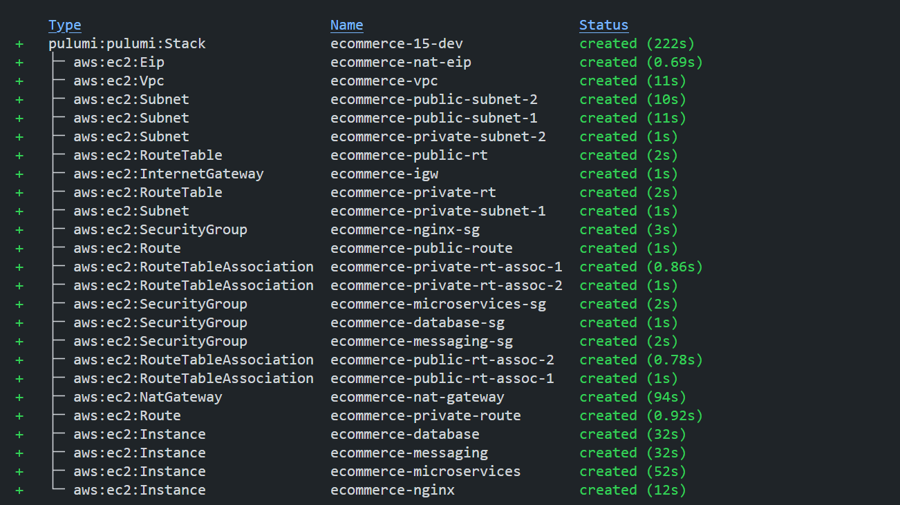

> **Note:** The `pulumi up` command will take some time to complete. After the infrastructure is created, you will have to wait for 10-15 minutes for the instances to be fully ready and the containers to be deployed.


## Check the Containers Status

1. **Connect to the Nginx instance:**

    ```bash
    ssh -i EcommerceKeyPair.pem ubuntu@<nginx_instance_public_ip>
    ```

2. **Connect to the Microservices instance:**

    ```bash
    ssh -i EcommerceKeyPair.pem ubuntu@<microservices_instance_public_ip>
    ```

3. **Check the status of the containers:**
    Run the following command to check the status of the containers in both the instances:

    ```bash
    docker ps
    ```

    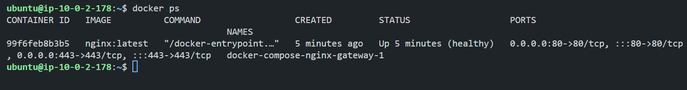

    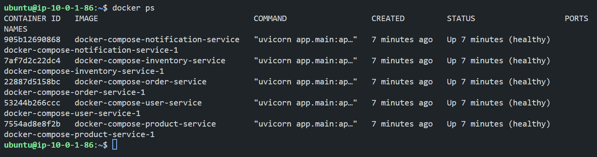

    > **Note:** If you see the nginx container is running and healthy, then all the containers should be running and healthy as the nginx container depends on the microservices container.

4. **You can also check the logs of the script that is running on the each instance by using the following command:**

    ```bash
    cat /var/log/cloud-init-output.log
    ```

    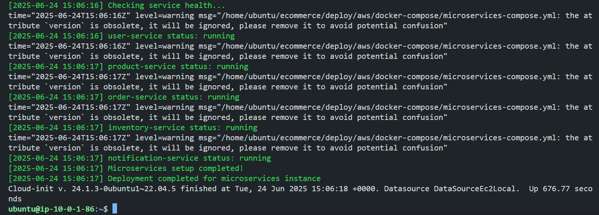

## Testing the System

### Quick Setup

**Set your AWS instance IPs from Pulumi outputs:**

```bash
export NGINX_IP="YOUR_NGINX_PUBLIC_IP"
export MICROSERVICES_IP="YOUR_MICROSERVICES_PUBLIC_IP"
```

### Basic Connectivity Test

Check if the nginx instance is accessible by using the following command:

```bash
curl -s "http://$NGINX_IP/health" | jq .
```

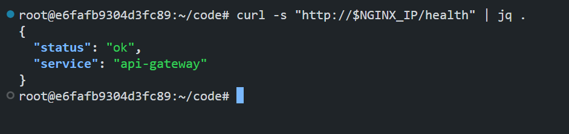

### User Registration & Authentication

We will take a journey of a user named `Sarah` who is a new customer visiting our e-commerce platform for the first time.

#### Sarah creates her account:

```bash
REGISTER_RESPONSE=$(curl -s -X POST "http://$NGINX_IP/api/v1/auth/register" \
  -H "Content-Type: application/json" \
  -d '{
    "email": "sarah@example.com",
    "password": "Password123",
    "first_name": "Sarah",
    "last_name": "Johnson",
    "phone": "555-123-4567"
  }')
```

Save the User ID from the response:

```bash
USER_ID=$(echo "$REGISTER_RESPONSE" | jq -r '.id')
```

#### Sarah logs in:

```bash
LOGIN_RESPONSE=$(curl -s -X POST "http://$NGINX_IP/api/v1/auth/login" \
  -H "Content-Type: application/x-www-form-urlencoded" \
  -d "username=sarah@example.com&password=Password123")
```

Save the token from the response:

```bash
TOKEN=$(echo "$LOGIN_RESPONSE" | jq -r '.access_token')
```

#### Sarah adds her shipping address:

```bash
curl -s -X POST "http://$NGINX_IP/api/v1/users/me/addresses" \
  -H "Authorization: Bearer $TOKEN" \
  -H "Content-Type: application/json" \
  -d '{
    "line1": "456 Tech Street",
    "line2": "Apt 12B",
    "city": "San Francisco",
    "state": "CA",
    "postal_code": "94105",
    "country": "USA",
    "is_default": true
  }' | jq .	
```

### Product Creation & Kafka Integration


#### Adding iPhone 15 Pro:

```bash
IPHONE_RESPONSE=$(curl -s -X POST "http://$NGINX_IP/api/v1/products/" \
  -H "Authorization: Bearer $TOKEN" \
  -H "Content-Type: application/json" \
  -d '{
    "name": "iPhone 15 Pro",
    "description": "Latest Apple smartphone with advanced camera system",
    "category": "Electronics",
    "price": 999.99,
    "quantity": 25
  }')

IPHONE_ID=$(echo "$IPHONE_RESPONSE" | jq -r '._id')
```

#### Adding AirPods Pro:

```bash
AIRPODS_RESPONSE=$(curl -s -X POST "http://$NGINX_IP/api/v1/products/" \
  -H "Authorization: Bearer $TOKEN" \
  -H "Content-Type: application/json" \
  -d '{
    "name": "AirPods Pro 2",
    "description": "Wireless earbuds with active noise cancellation",
    "category": "Audio",
    "price": 249.99,
    "quantity": 50
  }')

AIRPODS_ID=$(echo "$AIRPODS_RESPONSE" | jq -r '._id')
```

#### Adding Smart Watch:

```bash
WATCH_RESPONSE=$(curl -s -X POST "http://$NGINX_IP/api/v1/products/" \
  -H "Authorization: Bearer $TOKEN" \
  -H "Content-Type: application/json" \
  -d '{
    "name": "Smart Fitness Watch",
    "description": "Waterproof fitness tracker with heart rate monitoring",
    "category": "Wearables",
    "price": 179.99,
    "quantity": 8
  }')

WATCH_ID=$(echo "$WATCH_RESPONSE" | jq -r '._id')
```

#### Kafka Magic - Verifying automatic inventory creation:
```bash
curl -s "http://$NGINX_IP/api/v1/inventory/" | jq '.[] | {product_id, available_quantity, reorder_threshold}'
```

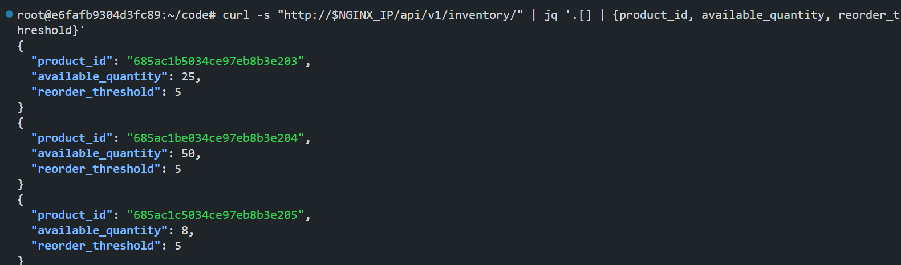

### Order Processing & RabbitMQ

#### Sarah places her order:
```bash
ORDER_RESPONSE=$(curl -s -X POST "http://$NGINX_IP/api/v1/orders/" \
  -H "Authorization: Bearer $TOKEN" \
  -H "Content-Type: application/json" \
  -d '{
    "user_id": "'$USER_ID'",
    "items": [
      {"product_id": "'$IPHONE_ID'", "quantity": 1, "price": 999.99},
      {"product_id": "'$AIRPODS_ID'", "quantity": 2, "price": 249.99}
    ],
    "shipping_address": {
      "line1": "456 Tech Street",
      "line2": "Apt 12B",
      "city": "San Francisco",
      "state": "CA",
      "postal_code": "94105",
      "country": "USA"
    }
  }')

ORDER_ID=$(echo "$ORDER_RESPONSE" | jq -r '._id')
```

#### RabbitMQ processes the order:

```bash
curl -s "http://$NGINX_IP/api/v1/orders/$ORDER_ID" -H "Authorization: Bearer $TOKEN" | jq .
``` 

#### Verify inventory was reserved

```bash
curl -s "http://$NGINX_IP/api/v1/inventory/" | \
  jq '.[] | select(.product_id == "'$IPHONE_ID'" or .product_id == "'$AIRPODS_ID'") | {product_id, available_quantity, reserved_quantity}'
```

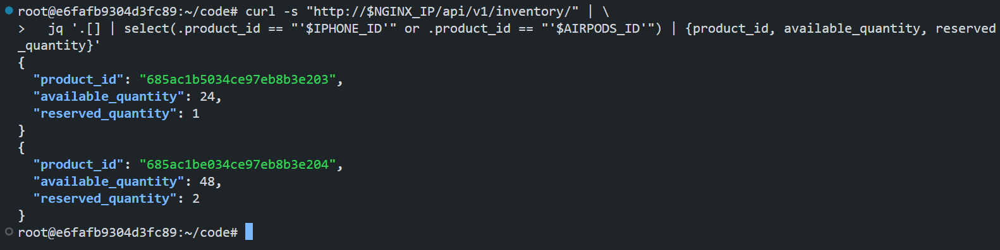

### Redis Integration & Email Alerts

####  Test the notification system:

```bash
curl -s -X POST "http://$NGINX_IP/api/v1/notifications/test" | jq .
```

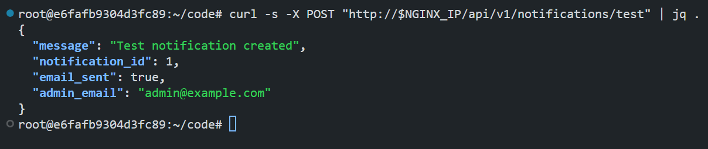

Check the mailtrap inbox for the email notification:

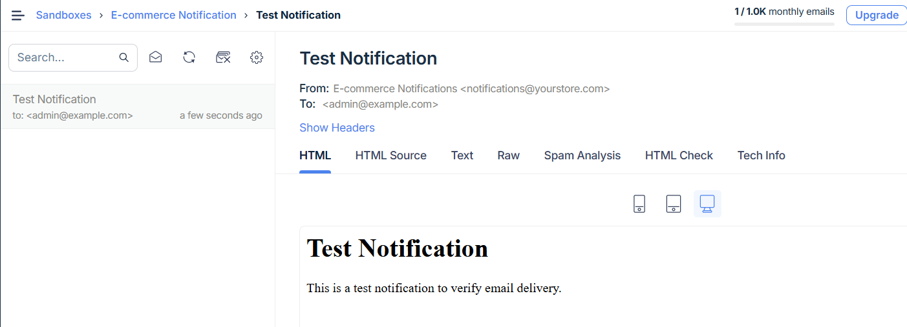

#### Trigger low stock alert (Method 1 - Direct Update):

```bash
curl -s -X PUT "http://$NGINX_IP/api/v1/inventory/$WATCH_ID" \
  -H "Authorization: Bearer $TOKEN" \
  -H "Content-Type: application/json" \
  -d '{
    "available_quantity": 2,
    "reorder_threshold": 6
  }' | jq '{product_id, available_quantity, reorder_threshold, status: "🚨 LOW STOCK"}'
```

Check the notifications:

```bash
curl -s "http://$NGINX_IP/api/v1/notifications/?limit=5" | \
  jq '.[] | select(.type=="low_stock") | {subject, status, created_at}'
```

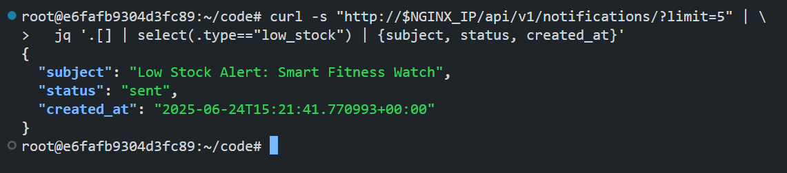

Check the mailtrap inbox for the email notification:

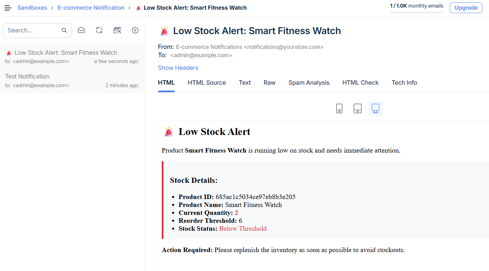

#### Trigger low stock alert (Method 2 - Order-Induced):

Creating bulk order to trigger automatic low stock alert:

```bash
BULK_ORDER=$(curl -s -X POST "http://$NGINX_IP/api/v1/orders/" \
  -H "Authorization: Bearer $TOKEN" \
  -H "Content-Type: application/json" \
  -d '{
    "user_id": "'$USER_ID'",
    "items": [
      {"product_id": "'$AIRPODS_ID'", "quantity": 45, "price": 249.99}
    ],
    "shipping_address": {
      "line1": "456 Tech Street",
      "city": "San Francisco",
      "state": "CA",
      "postal_code": "94105",
      "country": "USA"
    }
  }')

BULK_ORDER_ID=$(echo "$BULK_ORDER" | jq -r '._id')
```

Airpods inventory after bulk order:

```bash
curl -s "http://$NGINX_IP/api/v1/inventory/" | \
  jq '.[] | select(.product_id == "'$AIRPODS_ID'") | {
    product_id, 
    available_quantity, 
    reserved_quantity, 
    reorder_threshold,
    status: (if .available_quantity <= .reorder_threshold then "🚨 LOW STOCK" else "✅ OK" end)
  }'
```

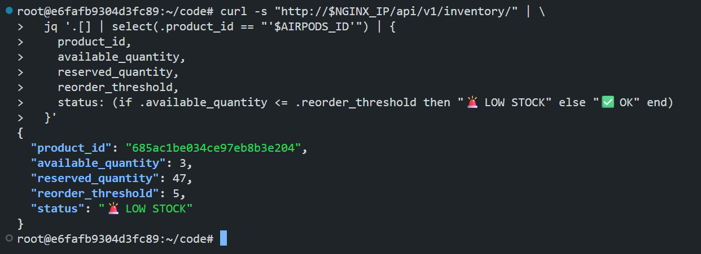

Verify notifications were sent:

```bash
curl -s "http://$NGINX_IP/api/v1/notifications/" | jq .
```

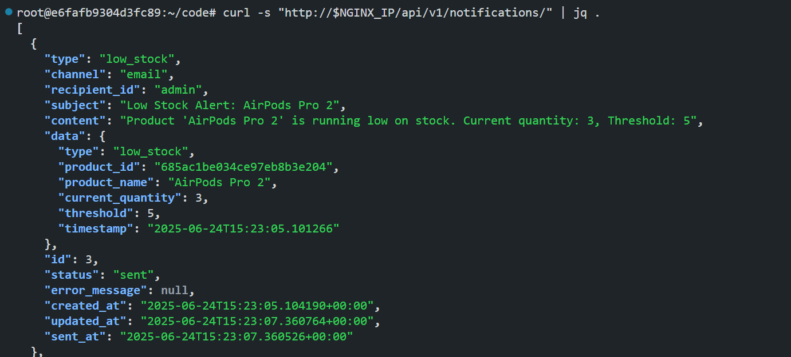

Check the mailtrap inbox for the email notification:

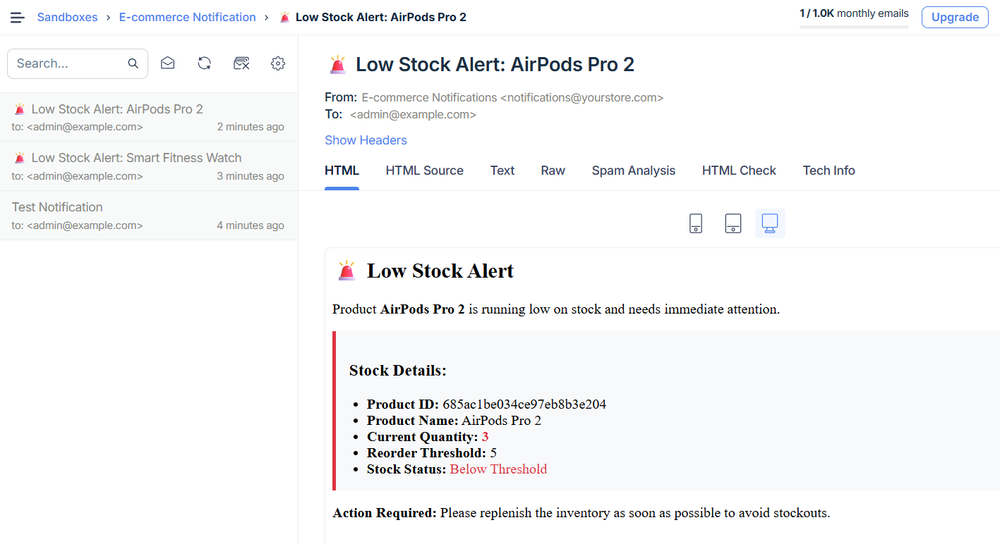

### Black Friday Crisis - Service Resilience Testing

*It's Black Friday! Suddenly, the inventory service crashes due to high load. But our system keeps running...*

#### The crash happens:

```bash
ssh -i ecommerce-infra/EcommerceKeyPair.pem ubuntu@$MICROSERVICES_IP \
  "cd /home/ubuntu/ecommerce/deploy/aws && docker-compose -f docker-compose/microservices-compose.yml stop inventory-service"
```

#### Customers keep shopping:

```bash
OUTAGE_ORDER=$(curl -s -X POST "http://$NGINX_IP/api/v1/orders/" \
  -H "Authorization: Bearer $TOKEN" \
  -H "Content-Type: application/json" \
  -d '{
    "user_id": "'$USER_ID'",
    "items": [{"product_id": "'$AIRPODS_ID'", "quantity": 1, "price": 249.99}],
    "shipping_address": {
      "line1": "456 Tech Street",
      "city": "San Francisco",
      "state": "CA",
      "postal_code": "94105",
      "country": "USA"
    }
  }')

OUTAGE_ORDER_ID=$(echo "$OUTAGE_ORDER" | jq -r '._id')
```

#### DevOps team fixes the service:

```bash
ssh -i ecommerce-infra/EcommerceKeyPair.pem ubuntu@$MICROSERVICES_IP \
  "cd /home/ubuntu/ecommerce/deploy/aws && docker-compose -f docker-compose/microservices-compose.yml start inventory-service"
```

#### Verify order was processed after recovery

```bash
curl -s "http://$NGINX_IP/api/v1/orders/$OUTAGE_ORDER_ID" -H "Authorization: Bearer $TOKEN" | jq .
```

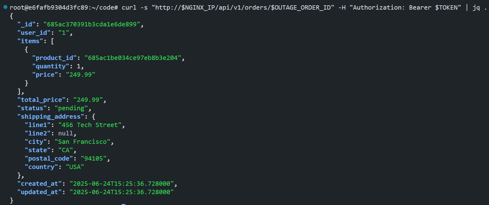

You will also get the email notification for the low stock alert as the inventory of the Airpods is less than the reorder threshold.


## Conclusion

This comprehensive testing guide demonstrates a real-world e-commerce platform that handles customer journeys, inventory management, and system resilience through modern microservices architecture. We deployed the system in AWS and tested the system by following the steps mentioned above.